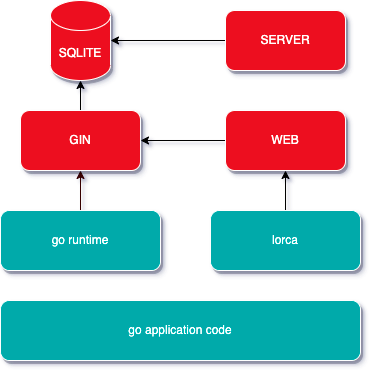

# vizzy

## 前言
提到数据大屏，通常大家的印象就是各种图表、表格的数据展示，然后不断地轮询后端接口。对于前端开发者来说，更多的关注点在于布局问题、图表的兼容性问题以及窗口变化后图表样式问题。对于后端来说，主要考虑的是如何在不断的请求中减轻服务器的压力。

但实际上，数据大屏的需求还远不止于此：

前端发布后应当可以作为应用直接运行，而不需要手动输入地址进行预览。
需要减轻服务器的压力，避免频繁的数据请求。
当前后端任何一方或双方都离线的情况下，数据仍能正常运行。
需要日志的存储，以便随时查看问题。
需要调用系统的能力和跨域调用API，以增加数据展示的灵活性。

## 解决方案
我采用了GO和lorca的方式来解决以上问题：

## Feature

* 打包体积轻量，仅20MB。
* 使用无头浏览器lorca，可自定义Chrome和JavaScript之间的交互。
* 支持交叉编译到Windows和Mac系统。
* 离线状态下也可以正常运行。
* 可以运行本地服务，减轻服务器压力。
* 编译速度快，运行性能优秀。

## 依赖项

该项目的依赖项如下：

* Go 1.20+
* node 14.8+

## 整体方案



## 安装

1. windows请切换到msys分支
2. git clone
3. cd frontend && yarn
4. 安装完成后，打开终端并运行以下命令：
```bash
./start.sh
```

## 发布

```bash
./build.sh
```


## 目录结构

```text
.
├── README.md
├── bootstrap 启动程序
├── build.sh 生产构建脚本
├── common 公共模块
├── dao 
├── dto
├── entity
├── frontend 前端
├── go.mod
├── go.sum
├── job 定时任务
├── lorca 
├── main.db
├── main.go
├── resources 前端生产包
├── service 接口
├── start.sh 开发环境构建脚本
└── start.sh 开发环境构建脚本
```

## why go？


## Go组件库
| 特性     | 地址           |
|--------|--------------|
| gin    | web服务        |
| gorm   | ORM（对象关系映射）库 |
| sqlite | 数据库          |
| cron   | 定时器          |
| lorca  | 无头浏览器        |
| gzip   | gzip         |
| logrus | 日志           |

## JS组件库
| 特性                    | 地址    |
|-----------------------|-------|
| vite                  | 打包工具  |
| react                 | spa   |
| echarts               | 图表    |
| rc-table              | 表格    |
| react-use             | hooks |
| @tanstack/react-query | 数据管理库 |
| axios                 | 请求    |

## 日志

开发环境输出在控制台

生产环境输出在app.log


